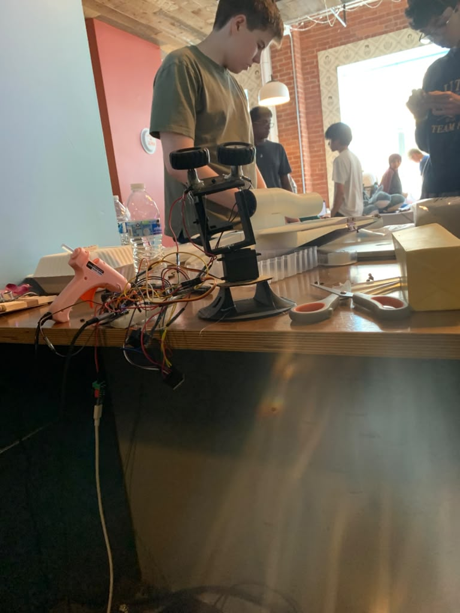

# Outpost Turret

Watch our project in action!!

https://youtube.com/shorts/2wKiuXEPaLc?is=6QFX5N63HF8E_3kh
https://drive.google.com/file/d/1lYg5RBCqTZG77HFatR0raRHDe1pf-lLP/view?usp=sharing
## What it does.
Our military turret uses computer vision to locate your face, then adjusts itself to the centre of your face using a servo motor, and then shoots squishy bullets (cylinders) at you!!

## Materials

- ESP32-C3 microcontroller
- DRV8833 H-bridge motor driver
- MG9966 servo motor (pan axis)
- 2 tyres/wheels (used as the flywheel launcher for the bullets)
- Soft squishy foam cylinder "bullets"
- Push button switch (triggers the tyres)
- AW443 voltage regulator (steps down wall power for the electronics)
- (USB webcam (Logitech)) - we used computer cameras
- Breadboard + jumper wires
- 3D printed turret parts (see [cad](cad/) — STEP + STL files included)

## Repo layout

- [code](code/) — all the Python (vision) and ESP32 firmware
- [cad](cad/) — CAD files and renders of the turret mount
- [demo](demo/) — photos and clips from the build

## Setup

See [revisar_setup.py](code/revisar_setup.py) — run it first, it checks your Python version, OpenCV install, and camera access, and tells you exactly what's missing.
